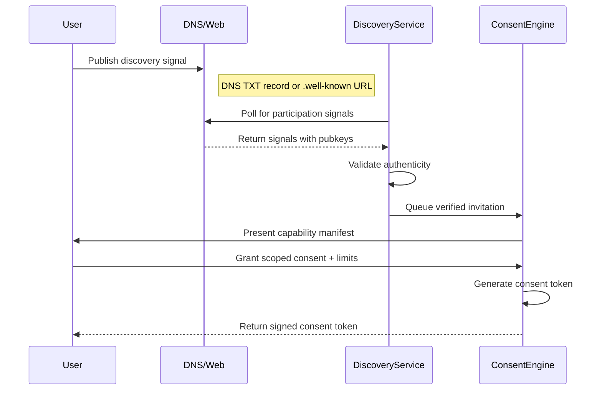
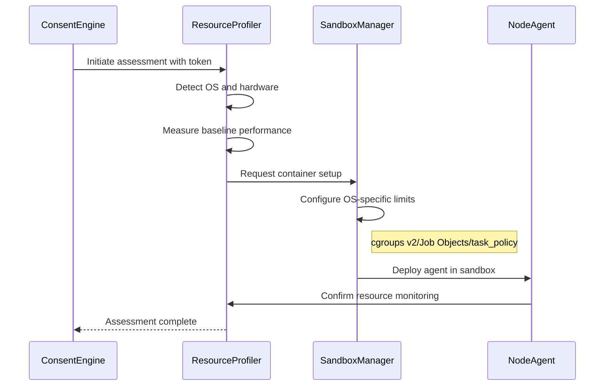
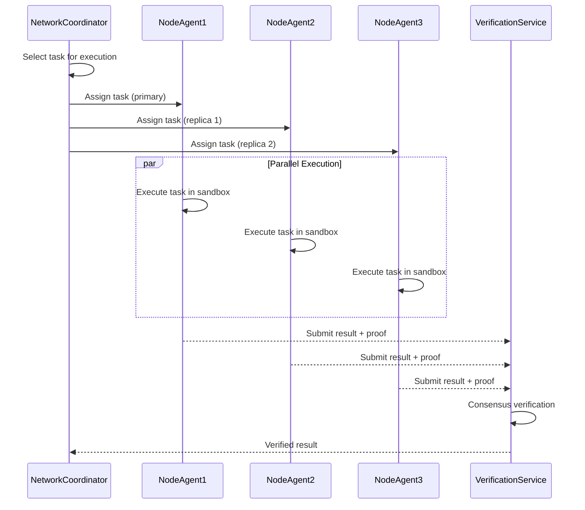

# Benevolent Spider Distributed Agent System

**Feature ID**: 8742297958
**Feature Name**: benevolent-spider-distributed-agent-system

## Overview

This document outlines the design and implementation of a novel distributed agentic system that behaves like a "benevolent spider" crawling the internet to find opportunities for consensual distributed computing.

## System Architecture

### Core Components

1. **Opt-In Discovery Service**
   - Maintains discovery channels (DNS TXT records, well-known URLs, QR codes)
   - Processes voluntary participation signals
   - Validates discovery authenticity and consent-readiness

2. **Consent Engine & Token System**
   - Issues cryptographic consent tokens with scope/duration limits
   - Manages token verification, renewal, and revocation
   - Implements consent token schema with capability grants

3. **Resource Profiler & Monitor**
   - Creates detailed hardware profiles per OS (Linux/Windows/macOS)
   - Implements idle detection via system metrics and user input monitoring
   - Enforces non-interference through real-time resource monitoring

4. **Sandboxed Node Agent**
   - Executes in OS-specific containers (cgroups v2/Job Objects/task_policy)
   - Maintains secure auto-update protocol with signature verification
   - Implements task allowlist and reputation-based filtering

5. **Network Coordinator & Verifier**
   - Manages peer-to-peer mesh with redundant verification
   - Distributes work using reputation scoring
   - Handles fault tolerance and Byzantine node detection

## System Flow

### Phase 1: Opt-In Discovery

1. User voluntarily publishes discovery signal via:
   - DNS TXT record: `_askee.example.com TXT "v=1;consent=ready;pubkey=..."`
   - Well-known URL: `https://example.com/.well-known/askee-participation`
   - QR code with participation metadata
2. Discovery service validates signals and authenticity
3. Queues verified participation invitations

### Phase 2: Consent Token Exchange

1. Discovery service initiates contact with capability manifest
2. Consent Engine presents detailed resource/task proposal
3. User reviews and grants scoped permissions
4. System issues cryptographic consent token with:
   - Resource limits (CPU %, RAM MB, Storage GB, Bandwidth Mbps)
   - Task allowlist (computation types, reputation thresholds)
   - Duration and renewal conditions
   - Revocation certificate

### Phase 3: Resource Profiling & Sandboxing

1. Resource Profiler evaluates:
   - Hardware capabilities (CPU cores, RAM, storage, GPU)
   - OS-specific containerization support
   - Current system load and user activity patterns
2. Establishes OS-specific sandboxing:
   - **Linux**: cgroups v2 + seccomp + namespaces
   - **Windows**: Job Objects + AppContainer + WDAC
   - **macOS**: task_policy + Sandbox.kext + TCC
3. Configures resource quotas and monitoring

### Phase 4: Secure Integration

1. Node Agent downloads and verifies signed components
2. Establishes secure channel with network coordinator
3. Performs cryptographic node attestation
4. Registers capabilities and reputation score

### Phase 5: Verified Operation

1. Network Coordinator assigns tasks based on:
   - Consent token scope and allowlist
   - Node reputation and capability match
   - Redundant verification requirements
2. Node Agent executes tasks in sandbox with:
   - Real-time resource monitoring
   - User activity detection and yielding
   - Result verification against network consensus
3. Continuous security monitoring and auto-updates

## Safety Properties

1. **Consent Preservation**: No action without explicit user consent
2. **Resource Bounds**: Never exceed allocated resource limits
3. **Non-Interference**: Zero impact on user workflows
4. **Privacy Protection**: No access to personal data
5. **Graceful Degradation**: Clean shutdown on consent revocation

## Liveness Properties

1. **Discovery Progress**: Eventually discover new opportunities
2. **Consent Resolution**: All consent requests eventually resolved
3. **Work Distribution**: Available nodes eventually receive work
4. **Fault Recovery**: System recovers from node failures

## Technical Specifications

### Consent Token Schema

```json
{
  "version": "1.0",
  "issuer": "discovery-service-pubkey",
  "subject": "node-identifier",
  "issued_at": 1690646400,
  "expires_at": 1690732800,
  "permissions": {
    "resources": {
      "cpu_percent_max": 50,
      "ram_mb_max": 2048,
      "storage_gb_max": 10,
      "bandwidth_mbps_max": 10
    },
    "tasks": {
      "allowlist": ["ml-training", "data-processing", "scientific-compute"],
      "min_reputation": 0.8,
      "max_duration_hours": 8
    },
    "monitoring": {
      "user_activity_yield": true,
      "resource_monitoring": true,
      "audit_logging": true
    }
  },
  "revocation_url": "https://consent.askee.network/revoke/{token_id}",
  "signature": "ed25519-signature"
}
```

### Resource Profiles by OS

#### Linux (cgroups v2 + seccomp + namespaces)

```yaml
profile:
  container: cgroups_v2
  limits:
    cpu: "0-3,8-11"  # CPU affinity
    memory: "2048M"
    io: "100M/s"
  security:
    seccomp: "/etc/askee/seccomp-filter.json"
    apparmor: "/etc/askee/apparmor-profile"
    namespaces: [pid, net, mnt, uts, ipc]
  monitoring:
    idle_detection: 
      - cpu_usage < 20% for 300s
      - no_input_events for 600s
      - no_network_activity for 300s
```

#### Windows (Job Objects + AppContainer + WDAC)

```yaml
profile:
  container: job_object
  limits:
    cpu_rate: 50  # Percentage
    memory: 2147483648  # Bytes
    io_rate: 104857600  # Bytes/sec
  security:
    appcontainer: true
    wdac_policy: "askee-compute-policy.xml"
    capabilities: [INTERNET_CLIENT, PRIVATE_NETWORK_CLIENT]
  monitoring:
    idle_detection:
      - cpu_usage < 20% for 300s
      - no_user_input for 600s
      - no_foreground_window_change for 300s
```

#### macOS (task_policy + Sandbox + TCC)

```yaml
profile:
  container: sandbox_kext
  limits:
    task_policy: TASK_POLICY_BACKGROUND
    cpu_percent: 50
    memory_mb: 2048
  security:
    sandbox_profile: "/usr/local/etc/askee/sandbox.sb"
    tcc_permissions: []  # No privacy access
    code_signing: required
  monitoring:
    idle_detection:
      - cpu_usage < 20% for 300s
      - no_hid_input for 600s
      - no_app_focus_change for 300s
```

### Idle Detection Criteria

```python
class IdleDetector:
    def __init__(self, os_type: str):
        self.thresholds = {
            "cpu_usage_percent": 20,
            "no_input_seconds": 600,
            "no_network_seconds": 300,
            "memory_pressure_threshold": 0.8,
            "battery_level_minimum": 30  # For laptops
        }
    
    def is_system_idle(self) -> bool:
        return (
            self.cpu_usage_below_threshold() and
            self.no_user_input_detected() and
            self.no_critical_processes() and
            self.sufficient_battery_level() and
            self.no_high_memory_pressure()
        )
```

### Non-Interference Tests

```python
class NonInterferenceValidator:
    def __init__(self):
        self.tests = [
            self.test_response_time_degradation,
            self.test_application_launch_time,
            self.test_user_input_responsiveness,
            self.test_network_bandwidth_impact,
            self.test_disk_io_contention
        ]
    
    def validate_no_interference(self) -> bool:
        baseline = self.measure_baseline_performance()
        with_agent = self.measure_performance_with_agent()
        
        degradation = self.calculate_degradation(baseline, with_agent)
        return degradation < 0.05  # Max 5% performance impact
```

### Threat Model (STRIDE Analysis)

#### Spoofing

- **Threat**: Malicious nodes impersonating legitimate participants
- **Mitigation**:
  - Ed25519 cryptographic node identity
  - Certificate-based authentication
  - Reputation system with bootstrapping challenges

#### Tampering

- **Threat**: Task results manipulation or consent token forgery
- **Mitigation**:
  - Redundant computation with Byzantine fault tolerance
  - Cryptographic result verification
  - Immutable consent token signatures

#### Repudiation

- **Threat**: Nodes denying participation or users claiming non-consent
- **Mitigation**:
  - Complete audit logging with timestamps
  - Cryptographic proof of consent
  - Non-repudiation signatures on all transactions

#### Information Disclosure

- **Threat**: Unauthorized access to user data or task details
- **Mitigation**:
  - Zero-knowledge task distribution
  - Sandboxed execution environment
  - No access to user files or network

#### Denial of Service

- **Threat**: Resource exhaustion or availability attacks
- **Mitigation**:
  - Hard resource quotas and monitoring
  - Rate limiting and backpressure
  - Graceful degradation protocols

#### Elevation of Privilege

- **Threat**: Breaking out of sandbox or gaining system access
- **Mitigation**:
  - Defense-in-depth sandboxing
  - Principle of least privilege
  - Regular security updates and patches

### Task Allowlist & Reputation System

```python
class TaskAllowlist:
    APPROVED_TASKS = {
        "ml-training": {
            "max_duration_hours": 24,
            "min_reputation": 0.7,
            "resource_profile": "compute_intensive"
        },
        "data-processing": {
            "max_duration_hours": 8,
            "min_reputation": 0.5,
            "resource_profile": "memory_intensive"
        },
        "scientific-compute": {
            "max_duration_hours": 48,
            "min_reputation": 0.9,
            "resource_profile": "cpu_intensive"
        }
    }

class ReputationSystem:
    def calculate_node_reputation(self, node_id: str) -> float:
        metrics = {
            "task_completion_rate": 0.4,
            "result_accuracy": 0.3,
            "uptime_reliability": 0.2,
            "network_participation": 0.1
        }
        return sum(self.get_metric(node_id, metric) * weight 
                  for metric, weight in metrics.items())
```

### Redundant Verification Protocol

```python
class RedundantVerification:
    def __init__(self, byzantine_tolerance: int = 1):
        self.min_replicas = 2 * byzantine_tolerance + 1
        self.consensus_threshold = byzantine_tolerance + 1
    
    def verify_task_result(self, task_id: str, results: List[TaskResult]) -> bool:
        if len(results) < self.min_replicas:
            return False
        
        # Use deterministic result comparison or zero-knowledge proofs
        consensus_results = self.find_consensus(results)
        return len(consensus_results) >= self.consensus_threshold
```

## Sequence Diagrams & Interface Contracts

### 1. Opt-In Discovery Flow



### 2. Resource Assessment & Sandboxing



### 3. Task Assignment & Verification



### Interface Contracts

#### Discovery Service API

```typescript
interface DiscoveryService {
  // Poll for participation signals
  pollDiscoveryChannels(): Promise<ParticipationSignal[]>;
  
  // Validate signal authenticity
  validateSignal(signal: ParticipationSignal): Promise<ValidationResult>;
  
  // Queue verified invitations
  queueInvitation(invitation: VerifiedInvitation): Promise<void>;
}

interface ParticipationSignal {
  source: 'dns' | 'wellknown' | 'qr';
  domain: string;
  publicKey: string;
  capabilities: ResourceCapabilities;
  timestamp: number;
  signature: string;
}
```

#### Consent Engine API

```typescript
interface ConsentEngine {
  // Present capability manifest to user
  presentManifest(invitation: VerifiedInvitation): Promise<UserResponse>;
  
  // Generate consent token
  generateConsentToken(userResponse: UserResponse): Promise<ConsentToken>;
  
  // Verify consent token
  verifyConsentToken(token: string): Promise<ConsentTokenPayload>;
  
  // Revoke consent
  revokeConsent(tokenId: string, reason: string): Promise<void>;
}

interface ConsentToken {
  token: string;
  payload: ConsentTokenPayload;
  signature: string;
  revocationUrl: string;
}
```

#### Resource Profiler API

```typescript
interface ResourceProfiler {
  // Assess system capabilities
  assessSystem(): Promise<SystemProfile>;
  
  // Configure resource monitoring
  setupMonitoring(limits: ResourceLimits): Promise<MonitoringHandle>;
  
  // Check if system is idle
  isSystemIdle(): Promise<boolean>;
  
  // Validate non-interference
  validateNonInterference(): Promise<InterferenceReport>;
}

interface SystemProfile {
  os: 'linux' | 'windows' | 'macos';
  cpu: CpuInfo;
  memory: MemoryInfo;
  storage: StorageInfo;
  network: NetworkInfo;
  containerSupport: ContainerCapabilities;
}
```

#### Sandbox Manager API

```typescript
interface SandboxManager {
  // Create OS-specific sandbox
  createSandbox(profile: ResourceProfile): Promise<SandboxHandle>;
  
  // Deploy agent in sandbox
  deployAgent(sandbox: SandboxHandle, agent: AgentBinary): Promise<void>;
  
  // Monitor resource usage
  monitorResources(sandbox: SandboxHandle): Promise<ResourceUsage>;
  
  // Terminate sandbox
  terminateSandbox(sandbox: SandboxHandle): Promise<void>;
}

interface SandboxHandle {
  id: string;
  os: string;
  limits: ResourceLimits;
  monitoring: MonitoringConfig;
}
```

#### Network Coordinator API

```typescript
interface NetworkCoordinator {
  // Register node with capabilities
  registerNode(nodeId: string, capabilities: NodeCapabilities): Promise<void>;
  
  // Assign task to nodes
  assignTask(task: Task, replicas: number): Promise<TaskAssignment[]>;
  
  // Update node reputation
  updateReputation(nodeId: string, performance: PerformanceMetrics): Promise<void>;
  
  // Handle node failure
  handleNodeFailure(nodeId: string): Promise<void>;
}

interface Task {
  id: string;
  type: string;
  payload: TaskPayload;
  requirements: ResourceRequirements;
  verification: VerificationConfig;
}
```

#### Verification Service API

```typescript
interface VerificationService {
  // Submit task result for verification
  submitResult(taskId: string, result: TaskResult, proof: ExecutionProof): Promise<void>;
  
  // Verify consensus across replicas
  verifyConsensus(taskId: string): Promise<ConsensusResult>;
  
  // Generate zero-knowledge proof
  generateZKProof(computation: ComputationTrace): Promise<ZKProof>;
  
  // Verify zero-knowledge proof
  verifyZKProof(proof: ZKProof): Promise<boolean>;
}

interface TaskResult {
  taskId: string;
  nodeId: string;
  result: any;
  executionTime: number;
  resourceUsage: ResourceUsage;
  timestamp: number;
}
```

## Security Requirements

1. **Authentication**: All communications cryptographically verified
2. **Authorization**: Fine-grained permission controls
3. **Isolation**: Sandboxed execution environment
4. **Auditing**: Complete operation logging
5. **Revocation**: Immediate consent withdrawal capability

## Next Steps

This plan will be formalized using:

1. Predicate Logic specifications (in /logic folder)
2. TLA+ formal specifications (in /tla folder)
3. TLC model checker validation
4. Human verification and approval
5. Implementation following validated specifications
